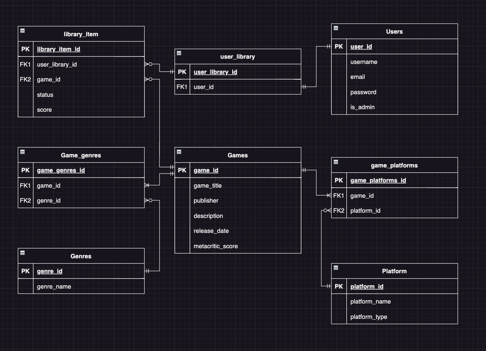

# T2A2 - Game Library API - Rahal Abeyrathna

An API application designed and created for the Coder Academy T2A2 assignment.

[Github Repository](https://github.com/RAbeyrathna/T2A2-Game-Library-API)

[Trello Board](https://trello.com/b/5PyPfbK5/t2a2-game-library-api)

## Table of Contents

- [Installation of API](#installation-of-api)
- [R1: Problem Identification](#r1-problem-identification)
- [R2: Problem Significance](#r2-problem-significance)
- [R3: Database System Selection and Drawbacks](#r3-database-system-selection-and-drawbacks)
- [R4: ORM Functionalities and Benefits](#r4-orm-functionalities-and-benefits)
- [R5: API Endpoints Documentation](#r5-api-endpoints-documentation)
- [R6: Entity-Relationship Diagram (ERD)](#r6-entity-relationship-diagram-erd)
- [R7: Third-Party Services Integration](#r7-third-party-services-integration)
- [R8: Application Models and Relationships](#r8-application-models-and-relationships)
- [R9: Database Relations](#r9-database-relations)
- [R10: Task Allocation and Tracking](#r10-task-allocation-and-tracking)

## Installation of API

The steps below assume you are running on a MacOS or Linux based operating system.

1. Clone the API to your local machine from the GitHub repo above
2. Open the `'src'` folder in your terminal of choice
3. Run `python3 -m venv venv`
4. Run `source venv/bin/activate`
5. Run `pip3 install -r requirements.txt` to install the required modules
6. Run `flask db init` to intialise the database and create the tables
7. Run `flask db seed` to get the default seed data for the database
8. Run `flask run` to start the flask server on `http://localhost:8080`

## R1: Problem Identification

> Explain the problem that the application is designed to solve.

This API application gives gamers an effective management system to track their extensive game libraries. Current services such as Steam and Epic Games host and allow players to play several games, but do not offer an effective way to track the progress of the game, a personal rating of the game or the current status of a game. These games can also span across several services and platforms, scattering the library a gamer and making it difficult to manage.

This application streamlines the process and allows users to catalog their games and to assign statuses and scores of their own personal library, allowing them to get on top of their gaming habits and track it extensively.

A common frustration that gamers face is to be in the middle of a game, only to start a brand new game that has come out and to abandon their old one, forgetting it entirely. This tool can allow for gamers to now easily and effectively manage their libraries and to keep up to date of all the games they have played.

It also allows for gamers to track their gaming habits, tracking games by their genre and platform, letting gamers see their preferences and biases, which can inform their future gaming purchases.

## R2: Problem Significance

> Discuss why this is an important problem that needs solving.

As users purchase more and more games, spanning over all the different services and platforms, it can be difficult to remember what games have been played and what they thought of a game. This tool now allows them to catalog these games and easily pull up what their favourite games might be, what scores they've given and the status of a game to easily come back to.

A gamer can now put a game "On-hold", allowing them to start a new game without the fear of forgetting any other game they may have been playing as it is logged in the system and can be filtered by the status. This gives users control of their library, and allows for another way for gamers to hone in on their gaming habits and to track data that would otherwise be difficult to find.

As games can be found on different platforms, it can be easy to forget what games really caught your attention and you were intrigued in as games are constantly coming out and gamers are constantly overwhelmed by the options. Now gamers can keep everything in a single place and can come back to it whenever they want to see what games they are currently playing or what to play next.

## R3: Database System Selection and Drawbacks

> Justify the choice of database system and discuss potential drawbacks.

For this application, I opted to use PostgreSQL (also referred to as PSQL) as the database system.

### Benefits of Using PSQL

#### ACID Compliance

PSQL is known for the robustness and reliability that it offers. It complies with the ACID principles (Atomicity, Consistency, Isolation, Durability) which are important to establish secure and reliable database transactions.

A quick overview of ACID can be found below:

- Atomicity
  - If any part of the database transaction fails, the database is *rolled back* and ensures nothing is changed.
- Consistency
  - The database stays *consistent* and so any data written follows the set up data validation rules.
- Isolation
  - Multiple transactions in the database *do not conflict* with each other, as each transaction is completed in *isolation*
- Durability
  - Any data transaction that is completed, will be saved to the database, even in the event of a *power outage* or *other systematic failure*

This is important for many applications, let alone the one developed here as we want to ensure that when users interact with this application, that the data being worked with is stored in the database correctly and doesn't conflict with other entries, especially as many users would be working with the application at the same time.

#### Feature set and Community

PSQL has many features such as nested transactions, online/hot backups and asynchronous replication, but the community supporting the system have also developed extensions which further extend to this functionality.

This includes international character sets, storage of large binary objects such as videos and pictures, and supoprt for Most SQL data types.

The community supporting PSQL is vast and dedicated, which is also backed by the fact that PSQL is open-source, allowing for anyone to view and modify the source code as they wish to.

### Drawbacks of Using PSQL

While PSQL has many beenfits to it, there are a few drawbacks to take into consideration as well. PSQL is commonly criticized as being slower compared to other options such as MySQL and may not be as suitable for larger businesses to implement.

Postgres can also have a larger learning curve which can make it tougher to implement as the developers involved will need to learn and adjust to the database system. This can in turn, make migration more difficult as well after establishing use through PSQL.

Other DBMS such as, *MySQL* may be more simple and easier to learn and get familiar with, but does not offer the same amount of features and benefits that Postgres does. It was through this careful consideration that PSQL was chosen, as for this particular instance, it was easier to implement and provided more benefits than drawbacks in implementation.

## R4: ORM Functionalities and Benefits

> Detail the key functionalities and advantages of using an ORM in this application.

Utilising an ORM (Object-Relational Mapping) framework gave many functional benefits to the development of the application such as:

- Relational mapping of the database tables
- Generating schemas and managing the schemas
- Quickly and easily seeding data for the application
- Allowing for a simple and less complicated way to interact with the database, away from the terminal

In this case, SQLAlchemy was used as the ORM of choice, and so rather than working directly in PSQL can be complicated and confusing, SQLAlchemy provides us with abstraction and makes it easier for developers to write and code in a lanugage they are comfortable in, which greatly saved time and improved the quality of experience during the development of the application.

Rather than connecting into the database directly and creating each table by scratch, managing the relationships and adding the data manually, the ORM allows us to specify the tables, relationships and data all within Python. We can then easily create custom queries and commands, initalise and recreate the tables as needed, and get a more simplified but just as powerful overview and control over the entire application.

The ORM provides the developers a simpler and much more intuitive experience in developing the application, making small tasks which could otherwise be repetitive and complicated, seamless and simple. It also makes the process simpler to get accustomed, and as such reduces the amount of time wasted trying to learn new systems and to complete tasks which could otherwise be completed in a shorter amount of time.

The use of an ORM also promotes scalability and maintainability of the application as a whole, as developers are easily able to add tables, update the schemas, adding seed data etc. The models/tables are much easier to read and understand, and as such just as easy to modify and fine tune as needed.

To streamline your documentation and avoid repeating the sub-headings "Parameters/Response Body" and "Response" for each endpoint, while still maintaining clarity and readability, you can adopt a format that clearly separates each endpoint and its details without excessive repetition. Here's a revised structure that could work for you:

## R5: API Endpoints Documentation

> List and describe all the API endpoints included in the application.

### Authentication Routes

#### `POST - /auth/register` (User Registration)

This route allows users to register an account with the application which can then be used in the `/auth/login` route.

**Parameters/Response Body**:

- `username`: String - the username of the user
- `password`: String - the password of the user

Example request body:

```JSON
{
    "username": "Test User 1",
    "email": "user1@email.com",
    "password": "abcd123@"
}
```

**Response**:

Returns the created user account details including user_id, username, email, is_admin status, and a newly created user_library_id.

Example response:

```JSON
{
    "user_id": 2,
    "username": "Test User 1",
    "email": "user1@email.com",
    "is_admin": false,
    "user_library": [
        {
            "user_library_id": 2
        }
    ]
}
```

#### `POST - /auth/login` (User Login)

This route allows users to login with an account that has been previously registered.

**Parameters/Response Body**:

- `email`: String - the email of the user
- `password`: String - the password of the user

Example request body:

```JSON
{
    "email": "user1@email.com",
    "password": "abcd123@"
}
```

**Response**:

Returns the JWT token of the logged in user, along with email and is_admin status.

Example response:

```JSON
{
    "email": "user1@email.com",
    "token": "(TOKEN HERE)",
    "is_admin": false
}
```

---

### User Routes

#### `GET - /users/{user_id}` (Get One User record)

This route allows users to retrieve an individual user record from the database.

**Parameters/Response Body**:

No parameters needed in the response body. Only a `user_id` in the route.

**Response**:

Returns the user record with the corresponding ID.

Example response:

```JSON
{
    "user_id": 2,
    "username": "Test User 1",
    "email": "user1@email.com",
    "is_admin": false,
    "user_library": [
        {
            "user_library_id": 2
        }
    ]
}
```

---

#### `GET - /users/` (Get all User records)

This route allows users to retrieve all user record from the database.

**Parameters/Response Body**:

No parameters needed in the response body

**Response**:

Returns all user records currently registered in the database.

Example response:

```JSON
[
    {
        "user_id": 1,
        "username": "Admin Account",
        "email": "admin@email.com",
        "is_admin": true,
        "user_library": [
            {
                "user_library_id": 1
            }
        ]
    },
    {
        "user_id": 2,
        "username": "Test User 1",
        "email": "user1@email.com",
        "is_admin": false,
        "user_library": [
            {
                "user_library_id": 2
            }
        ]
    }
]
```

---

#### `DELETE - /users/{user_id}` (Delete a User record)

This route allows a user to delete an account from the database.
It requires the user to be logged in with an **admin** account or the owner of the account being deleted.

**Parameters/Response Body**:

- `user_id` of the account to be deleted is passed through the route

**Response**:

Example response:

```JSON
{
    "message": "User with ID '2' has been deleted successfully"
}
```

---

#### `UPDATE - /users/{user_id}` (Update a User record)

This route allows a user to modify an account from the database.
It requires the user to be logged in with an **admin** account or the owner of the account being edited.

**Parameters/Response Body**:

- `user_id` of the account to be modified is passed through the route
- The body contains the fields to be modified in the record

Example body-

```JSON
{
    "username": "User 1",
    "email": "username1@email.com"
}
```

**Response**:

Returns the user account with the updated fields.

Example response:

```JSON
{
    "user_id": 2,
    "username": "User 1",
    "email": "username1@email.com",
    "is_admin": false,
    "user_library": [
        {
            "user_library_id": 2
            }
    ]
}
```

---

### Genre Routes

#### `GET - /genres/{genre_id}` (Get One Genre record)

This route allows users to retrieve an individual user record from the database.

**Parameters/Response Body**:

No parameters needed in the response body. Only a `user_id` in the route.

**Response**:

Returns the user record with the corresponding ID.

Example response:

```JSON
{
    "user_id": 2,
    "username": "Test User 1",
    "email": "user1@email.com",
    "is_admin": false,
    "user_library": [
        {
            "user_library_id": 2
        }
    ]
}
```

---

#### `GET - /genres/` (Get all Genre records)

This route allows users to retrieve all genre record from the database.

**Parameters/Response Body**:

No parameters needed in the response body

**Response**:

Returns all genre records currently registered in the database.

Example response:

```JSON
[
    {
        "user_id": 1,
        "username": "Admin Account",
        "email": "admin@email.com",
        "is_admin": true,
        "user_library": [
            {
                "user_library_id": 1
            }
        ]
    },
    {
        "user_id": 2,
        "username": "Test User 1",
        "email": "user1@email.com",
        "is_admin": false,
        "user_library": [
            {
                "user_library_id": 2
            }
        ]
    }
]
```

---

#### `DELETE - /genres/{genre_id}` (Delete a Genre record)

This route allows a user to delete a genre from the database.
It requires the user to be logged in with an **admin** account.

**Parameters/Response Body**:

- `genre_id` of the account to be deleted is passed through the route

**Response**:

Example response:

```JSON
{
    "message": "User with ID '2' has been deleted successfully"
}
```

---

#### `UPDATE - /genres/{genre_id}` (Update a Genre record)

This route allows a user to modify a genre record from the database.
It requires the user to be logged in with an **admin** account.

**Parameters/Response Body**:

- `genre_id` of the account to be modified is passed through the route
- The body contains the fields to be modified in the record

Example body-

```JSON
{
    "username": "User 1",
    "email": "username1@email.com"
}
```

**Response**:

Returns the genre with the updated fields.

Example response:

```JSON
{
    "user_id": 2,
    "username": "User 1",
    "email": "username1@email.com",
    "is_admin": false,
    "user_library": [
        {
            "user_library_id": 2
            }
    ]
}
```

### Platform Routes

#### `GET - /platforms/{platform_id}` (Get One Platform record)

This route allows users to retrieve an individual platform record from the database.

**Parameters/Response Body**:

No parameters needed in the response body. Only a `platform_id` in the route.

**Response**:

Returns the platform record with the corresponding ID.

Example response:

```JSON
{
    "user_id": 2,
    "username": "Test User 1",
    "email": "user1@email.com",
    "is_admin": false,
    "user_library": [
        {
            "user_library_id": 2
        }
    ]
}
```

---

#### `GET - /platforms/` (Get all Platform records)

This route allows users to retrieve all platform record from the database.

**Parameters/Response Body**:

No parameters needed in the response body

**Response**:

Returns all platform records in the database.

Example response:

```JSON
[
    {
        "user_id": 1,
        "username": "Admin Account",
        "email": "admin@email.com",
        "is_admin": true,
        "user_library": [
            {
                "user_library_id": 1
            }
        ]
    },
    {
        "user_id": 2,
        "username": "Test User 1",
        "email": "user1@email.com",
        "is_admin": false,
        "user_library": [
            {
                "user_library_id": 2
            }
        ]
    }
]
```

---

#### `DELETE - /platforms/{platform_id}` (Delete a Platform record)

This route allows a user to delete a platform from the database.
It requires the user to be logged in with an **admin** account.

**Parameters/Response Body**:

- `platform_id` of the account to be deleted is passed through the route

**Response**:

Example response:

```JSON
{
    "message": "User with ID '2' has been deleted successfully"
}
```

---

#### `UPDATE - /platforms/{platform_id}` (Update a Platform record)

This route allows a user to modify a platform from the database.
It requires the user to be logged in with an **admin** account.

**Parameters/Response Body**:

- `platform_id` of the account to be modified is passed through the route
- The body contains the fields to be modified in the record

Example body-

```JSON
{
    "username": "User 1",
    "email": "username1@email.com"
}
```

**Response**:

Returns the platform with the updated fields.

Example response:

```JSON
{
    "user_id": 2,
    "username": "User 1",
    "email": "username1@email.com",
    "is_admin": false,
    "user_library": [
        {
            "user_library_id": 2
            }
    ]
}
```

### Game Routes

#### `GET - /games/{game_id}` (Get One Game record)

This route allows users to retrieve an individual game record from the database.

**Parameters/Response Body**:

No parameters needed in the response body. Only a `game_id` in the route.

**Response**:

Returns the game record with the corresponding ID.

Example response:

```JSON
{
    "user_id": 2,
    "username": "Test User 1",
    "email": "user1@email.com",
    "is_admin": false,
    "user_library": [
        {
            "user_library_id": 2
        }
    ]
}
```

---

#### `GET - /games/` (Get all Game records)

This route allows users to retrieve all game records from the database.

**Parameters/Response Body**:

No parameters needed in the response body

**Response**:

Returns all game records currently registered in the database.

Example response:

```JSON
[
    {
        "user_id": 1,
        "username": "Admin Account",
        "email": "admin@email.com",
        "is_admin": true,
        "user_library": [
            {
                "user_library_id": 1
            }
        ]
    },
    {
        "user_id": 2,
        "username": "Test User 1",
        "email": "user1@email.com",
        "is_admin": false,
        "user_library": [
            {
                "user_library_id": 2
            }
        ]
    }
]
```

---

#### `DELETE - /games/{game_id}` (Delete a Game record)

This route allows a user to delete an account from the database.
It requires the user to be logged in with an **admin** account.

**Parameters/Response Body**:

- `game_id` of the account to be deleted is passed through the route

**Response**:

Example response:

```JSON
{
    "message": "User with ID '2' has been deleted successfully"
}
```

---

#### `UPDATE - /games/{game_id}` (Update a Game record)

This route allows a user to modify a game record from the database.
It requires the user to be logged in with an **admin** account.

**Parameters/Response Body**:

- `game_id` of the account to be modified is passed through the route
- The body contains the fields to be modified in the record

Example body-

```JSON
{
    "username": "User 1",
    "email": "username1@email.com"
}
```

**Response**:

Returns the game with the updated fields.

Example response:

```JSON
{
    "user_id": 2,
    "username": "User 1",
    "email": "username1@email.com",
    "is_admin": false,
    "user_library": [
        {
            "user_library_id": 2
            }
    ]
}
```

### Library Routes

## R6: Entity-Relationship Diagram (ERD)

> Provide an ERD to visualize the database schema of the application.



## R7: Third-Party Services Integration

> Describe any third-party services the application relies on and their purposes.

### PostgreSQL

PostgreSQL is an open-source relational database system. It is used to store and manage data, and offers many features such as views, foreign key referential integrity, and sophisticated locking. This application utilises it as the primary relational database to manage all the information of the system.

### Flask

Flask is a lightweight WSGI web application framework used to build this application. It is simple and easy to implement, and is very powerful to run web applications.

### SQLAlchemy

SQLAlchemy is Python based ORM that allows developers to work with databases without needing to directly interact with the database system. It is designed for efficient and high-performing database access with high level abstraction to make it simple and easy for developers to utilise.

### Psycopg2

Psycopg2 is a PostgreSQL adapter for Python and is used as a bridge between the Python language and the PostgreSQL database. Through this, we are able to use Python code to execute SQL commands and directly connect to the PSQL database in this application.

### Bcrypt

Bcrypt is a password-hashing function that was used to hash any passwords that users register with in the application. When the user registers, Bcrypt creates and stores the hash rather than directly saving a readable string of the password. It is also used to decode and compare the hash when logging in.

### Marshmallow

Marshmallow is an ORM framework library that assists in converting the data type of the SQL database into python readable data types. It's's typically used for object serialization and deserialization, and it's especially useful for turning database models into JSON objects which can be used in RESTful APIs.

### JWT-Extended

JWT-Extended is an extension used for Flask that allows the use of JSON Web Tokens (JWT). This applciation utilises it to create tokens for users to login with and provide authentication and verification of user privileges throughout the application.

### dotenv

dotenv is a library used to load environment variables from a `.env` file. This was used to keep sensitive vairables and data in a seperate file, which configure and set up the application such as secret keys or database logins.

## R8: Application Models and Relationships

> Explain the models used in the project and the relationships between them.

The models used in this application are seperated into seperate files.

The user model defines the user table in the relational database and is used to represent the user accounts that are used in the application.

It is set up as follows:

`User Model`

```python
class User(db.Model):
    __tablename__ = "users"

    user_id = db.Column(db.Integer, primary_key=True)
    username = db.Column(db.String)
    email = db.Column(db.String, nullable=False, unique=True)
    password = db.Column(db.String, nullable=False)
    is_admin = db.Column(db.Boolean, default=False)

    user_library = db.relationship(
        "User_library", back_populates="user", cascade="all, delete"
    )
```

 A user relates directly to the `user_library` model with a one-to-one relationship, as a user_library is created at the time a user account is created. These are directly linked with the *user_id* acting as a foreign key in the `user_library` model. The `user_library` model also acts as a junction between the `user` and `library_item` models as the two have a many-to-many relationship.

`User_library Model`

 ```python
class User_library(db.Model):
    __tablename__ = "user_library"

    user_library_id = db.Column(db.Integer, primary_key=True)
    user_id = db.Column(
        db.Integer, db.ForeignKey("users.user_id"), nullable=False
    )

    user = db.relationship("User", back_populates="user_library")

    library_items = db.relationship(
        "Library_item", back_populates="user_library", cascade="all, delete"
    )
 ```

The User_library stores the *user_id* to represent who owns the library, and acts as a junction table to relate the user model to the `library_item` model.

 When a user account is deleted, the according user_library is also deleted as it cannot exist without the corresponding user account. This is accomplished using `cascade="all, delete"`.

 As can be seen in the `user_library` model, it also has a one-to-many relationship with the `library_item` model as the libary_items have a foreign key which is associated to the `user_library` primary key.

`Library Item Model`

 ```python
 class Library_item(db.Model):
    __tablename__ = "library_items"

    library_item_id = db.Column(db.Integer, primary_key=True)
    status = db.Column(db.String)
    score = db.Column(db.Integer)

    user_library_id = db.Column(
        db.Integer,
        db.ForeignKey("user_library.user_library_id"),
        nullable=False,
    )

    game_id = db.Column(
        db.Integer, db.ForeignKey("games.game_id"), nullable=False
    )

    user_library = db.relationship(
        "User_library", back_populates="library_items"
    )

    game = db.relationship("Game", back_populates="library_items")

    __table_args__ = (
        UniqueConstraint(
            "game_id", "user_library_id", name="unique_game_entry"
        ),
    )
 ```
 
 The `library_item` model acts as the individual entries that a user can add to their libraries to track games that they want to catalog. As such, it holds the *library_id* of the corresponding user and the *game_id* of the game to track. Both the library_id and game_id are foreign keys in this model.

 If the user_library is deleted (which is when a user is deleted), all of the associated library_items are then also deleted using `cascade="all, delete"`.

The library item also has a one-to-many relationship with the `games` model, as a library_item must have the corresponding *game_id* for the library entry.

`Game Model`

```python
class Game(db.Model):
    __tablename__ = "games"

    game_id = db.Column(db.Integer, primary_key=True)
    game_title = db.Column(db.String, nullable=False)
    publisher = db.Column(db.String)
    description = db.Column(db.String)
    release_date = db.Column(db.Date)
    metacritic_score = db.Column(db.Integer)

    game_genres = db.relationship(
        "Game_genre", back_populates="game", cascade="all, delete"
    )

    game_platforms = db.relationship(
        "Game_platform", back_populates="game", cascade="all, delete"
    )

    library_items = db.relationship(
        "Library_item", back_populates="game", cascade="all, delete"
    )
```

The game model itself does not hold any foreign keys and acts to store the main data of the games in the application. It stores the main information such as a description of the game, the publisher of the game and the release date of it. 

It relates to two seperate junction tables, which are represented by the `game_genre` and `game_platform` models. This is because the game model has a one-to-many relation with both the `genre` and `platform` models, as a game can have multiple genres and genres can belong to multiple games, and vice versa for platforms.

`Genre Model`

```python
class Genre(db.Model):
    __tablename__ = "genres"

    genre_id = db.Column(db.Integer, primary_key=True)
    genre_name = db.Column(db.String, nullable=False, unique=True)

    game_genres = db.relationship(
        "Game_genre", back_populates="genre", cascade="all, delete"
    )
```

The genre model simply holds the *genre_name* and corresponding id of said genre. 

It relates directly to the `game_genre` model, and has the same `cascade="all, delete"` as if a genre is deleted, then all associated game entries should also be deleted.

`Game_genre Model`

```python
class Game_genre(db.Model):
    __tablename__ = "game_genres"

    game_genres_id = db.Column(db.Integer, primary_key=True)

    game_id = db.Column(
        db.Integer, db.ForeignKey("games.game_id"), nullable=False
    )

    genre_id = db.Column(
        db.Integer, db.ForeignKey("genres.genre_id"), nullable=False
    )

    game = db.relationship("Game", back_populates="game_genres")
    genre = db.relationship("Genre", back_populates="game_genres")

    __table_args__ = (
        UniqueConstraint("game_id", "genre_id", name="unique_game_genre"),
    )
```

The `game_genre` model takes the primary key from the `genre` model as a foreign key and also takes the primary key of the `game` model.

This model can then represent the many to many relationship between the `genre` and `game` models.

`Platform Model`

```python
class Platform(db.Model):
    __tablename__ = "platforms"

    platform_id = db.Column(db.Integer, primary_key=True)
    platform_name = db.Column(db.String, nullable=False, unique=True)
    platform_type = db.Column(db.String, nullable=False)

    game_platforms = db.relationship(
        "Game_platform", back_populates="platform", cascade="all, delete"
    )
```

The `platform` and `game_platform` models are nearly identical to the `genre` and `game_genre` models as they have the same type of relationship.

The `platform` model has different fields to represent the data it holds such as a *platform_type* to represent different types of platforms (Handhelds, console, computers).

If a platform entry is deleted, then all associated game_platforms are also deleted.

`Game_platform Model`

```python
class Game_platform(db.Model):
    __tablename__ = "game_platforms"

    game_platforms_id = db.Column(db.Integer, primary_key=True)

    game_id = db.Column(
        db.Integer, db.ForeignKey("games.game_id"), nullable=False
    )

    platform_id = db.Column(
        db.Integer, db.ForeignKey("platforms.platform_id"), nullable=False
    )

    game = db.relationship("Game", back_populates="game_platforms")
    platform = db.relationship("Platform", back_populates="game_platforms")

    __table_args__ = (
        UniqueConstraint(
            "game_id", "platform_id", name="unique_game_platform"
        ),
    )
```

Finally we have the `game_platform` model which stores the foreign keys of both the *game_id* and the associated *platform_id*. This is set up identically to the `game_genre` model.


## R9: Database Relations

> Discuss how database relations are implemented within the application.

The Users table is central to the application, with each user identified by a unique user_id (PK). Users are related to user_library through a one-to-one relationship, as each user can have a single library and a library can only be associated with a single user.

The user_library itself is then related to the library_item table through a zero-to-many relationship, as the library itself can have several library_items, which represent entries that a user would have in their game library. The user_library's primary key (user_library_id) is passed to the library_item table as a foreign key.

The library_item and games table also have a zero-to-many relationship as a game can be apart of zero or many library entries, however the library entry itself can only associate to a single game at a time. The library_item table also takes the primary key of game_id from the games table as a foreign key.

As such, each library entry belongs to a single library and is associated to only one user and a particular game.

An example entry would look like the following:

| library_item_id | game_id | user_library_id | score | status |
|----------|----------|----------|----------|----------|
| 1 | 2 | 1 | 70 | Playing |

In this entry, the user which owns library_id 1, is currently playing the game with game_id 2. The entry itself has a unique identifier of library_item_id 1.

The Games is the core of the application, and contains details such as game_title, publisher, description, and metacritic_score. This table has a many-to-many relationship with the Genres table through the associative junction table Game_genres, which connects games to their respective genres using game_id and genre_id as foreign keys. This relationship allows a game to belong to multiple genres and a genre to include multiple games.

Similarly, there's a many-to-many relationship between the Games table and the Platform table via game_platforms. This also represents that a game can be available on multiple platforms, and a platform can support multiple games.

## R10: Task Allocation and Tracking

> Outline how tasks are allocated and tracked during the project's development.

During the development of this project, I used Trello to track and manage the tasks I needed to complete.

At the beginning of the project, I made a list of goals and deliverables I wanted to complete, and broke these down into subtasks and into cards where suitable.

Each card then was given sub-tasks to break it down and work on individually.

I reviewed through the assignment rubric and ensured that there were cards tailored to ensuring I was on track and completing the assignment according to the rubric.

I would put all the tasks into the backlog initially, and would slowly move them into the `To Do` section once I was getting ready to work on them.

At the start of the day, I would review the Trello board, and move any tasks into the `Doing` section and focus on working those before looking back at the `To Do` and `Backlog` sections.

At some points, I would get carried away and work on parts or aspects of the application which would be apart of a card I wasn't focusing on, but I would simply tick of the relevant task on the card when this would happen.

I made sure to use due date to help keep me on track and to manage my workload so I could focus and prioritise tasks, and ensure I was staying within the time frame and completing the entire project on-time.


